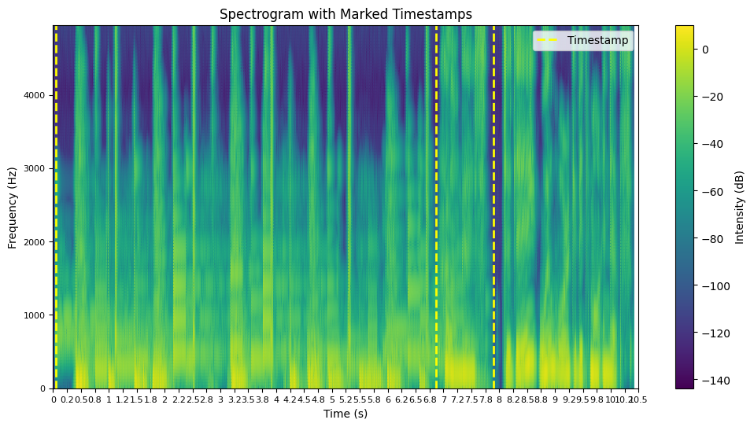
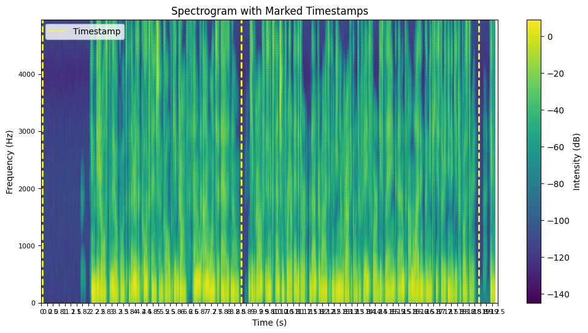
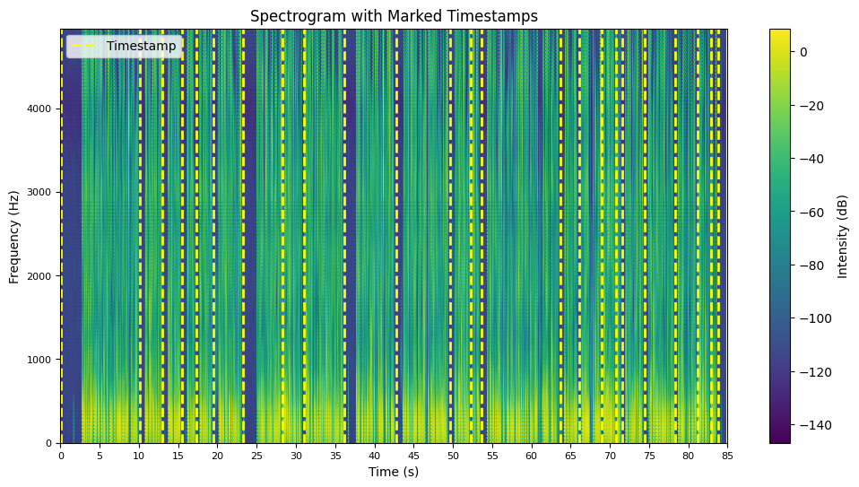
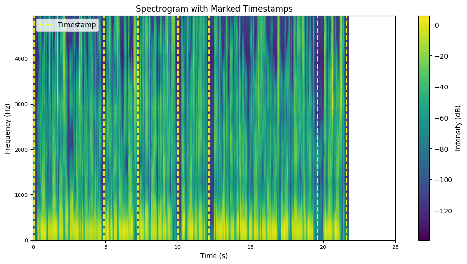

# speech_2024

Working with speech data. 

## Workflow:

1. (Setting up) Speech-Silence (intervals)
   
   Sectioning up long audio sequences into speech-silence intervals.
   
   Preferably, I'd like a single stream to handle any particular language for this initial bit of preprocessing.
   
   Outputs a PRAAT TextGrid with 'speech' and '' (silence) intervals.
   
3. (Adding) Transcription
   
   Sectioning up written transcription of audio into these intervals (including creating corresponding PRAAT TextGrid of its own).
   
   Automatic transcription with a LLM or other pretrained model serves as an alternative option.
   
5. Forced Alignment
   
   Forced Alignment of phones and words, ending up with csv files with intervals for both.
   
6. Features / Patterns
   
   Building systems to experiment with extracting different acoustic features and evaluating importance, primarily for prosody.
   
   Intensity,energy,power,pitch,amplitude. Likely will use parselmouth along with method to make it continuous.

## Scripts & Notebooks

1. Speech-Silence

**speech-silence0-pub.ipynb**: first version of (public) notebook for sectioning speech and non-speech intervals (*silence*/*non-speech* serves as catch-all terms for low-power points contrastive with speech).

**ex-out_speech-silencex.png** where x=num; example outputs of **speech-silence0-pub.ipynb** below.

(In these examples, audacity was used to preprocess the audio files with settings of either 12 and 6.00 db for Noise Reduction level and Sensitivity respectively, or 34 and 1.50 db; however, this is variable to the peculiarities of the audio itself.)

Figure 1             |  Figure 2
:-------------------------:|:-------------------------:
 | 

Figures 3 & 4 are visualized outputs where min_interval parameter for the filter_intervals() function is set to 0.5 seconds and the tick-mark interval is set to 5 seconds:

Figure 3             |  Figure 4
:-------------------------:|:-------------------------:
 | 

On this same topic, **speech-silencex-pub.py** (where 'x' is again version num) does the same thing as the notebook except it results in a PRAAT TextGrid file with intervals instead of a visualization. The packages needed for this are also fewer in number.

